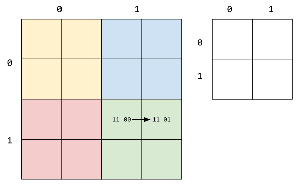
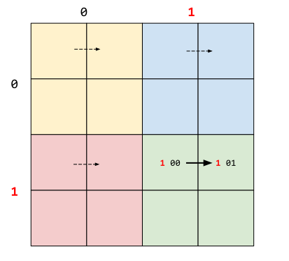

Compact Position Reporting
==========================

The position information in ADS-B messages is encoded in a compact position reporting (CPR) format. The general idea behind CPR is to be able to encoding more coordinate decimals using less bits. It is archive by trading global position ambiguity and time with local position accuracy.

Example
-------

An easy example to understand the principle behind CPR:

Imaging the world is constructed by 16 grid, which we have divided into two level, each level are encoded with two bits. Higher level in color are `00` (yellow), `01` (blue), `10` (red), `11` (green). And within each color grid, the lower levels are also encoded similarly.

Then each grid can be represented as 4 digit from `0000` to `1111`. Now, we want to describe the movement indicated as the arrows in the green grids `1100 -> 1101`, but we only have 3 bits to encode each position.

It is easy to see that the high 2 bits appeared in all positions, so we can define a structure to do the following:

::

  1. The last two bits shall represent the local position
  2. The combination of first digit from two messages defines the higher grid

The then two message can be sent as `1 00 -> 1 01`

From lower bits `00 -> 01`, we have four different possibility of movement as show in dashed arrows, and from the two first bit combination `11`, we know the the arrow shall represent the movement in the green grids:

The CPR and functions
---------------------

The actual CPR algorithm of course is more complicated, but the principle is very similar to previous example. If only one message is given, it is possible to find multiple solutions that are spaced around the world. The combination of two (different types of) messages will yield the final result.

In CPR encoding, the earth is divided in many zones (similar to the grid in previous example). And the encoding algorithm is also more complicated (described in later section). First, we will list some of the parameters and common functions used in the decoding process here.

NZ
**

Number of geographic latitude zones between equator and a pole. It is set to ``NZ = 15`` for Mode-S CPR encoding

floor(x)
********

the floor function ``floor(x)`` defines as the greatest integer value k, such that ``k<=x``, for example:
::

  floor(5.6) = 5
  floor(-5.6) = -6

mod(x, y)
*********

the modulus function ``mod(x, y)`` return:

.. math::

  x - y \cdot floor(\frac{x}{y})

where ``y`` can not be zero

NL(lat)
*******

Denotes the "number of longitude zones" function, given the latitude angle ``lat``. The returned integer value is constrained within ``[1, 59]``, calculated as:

.. math::

  \text{NL}(lat) = floor \left( \frac{2 \pi}{\arccos(1 - \frac{1-\cos(\frac{\pi}{2 \cdot \text{NZ}})}{\cos^2(\frac{\pi}{180} \cdot \text{lat})}) } \right)

For latitudes that are close to equator or poles, following value is returned:
::

  lat = 0     ->    NL = 59
  lat = +87   ->    NL = 2
  lat = -87   ->    NL = 2
  lat > +87   ->    NL = 1
  lat < -87   ->    NL = 1